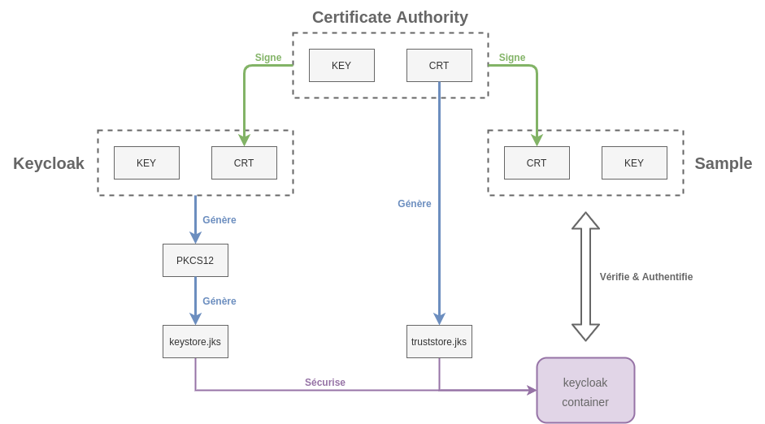
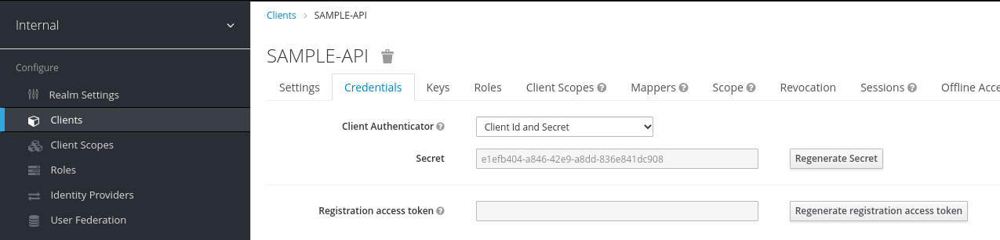
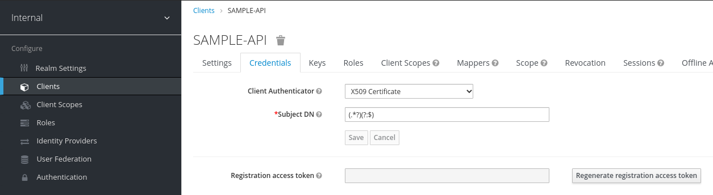

Keycloak authentication via X509 certificate
============================================

Présentation
------------

Keycloak allows many methods of authentication. The use of x509 certificate is one of these methods. It is very convenient to reinforce the machine-to-machine authentication without passing any secret on the network.

This repository guides you though a proof of concept wich is testing this autentication technique.

Walkthrough
-----------

First of all, we should generate a pki following this scheme:



A certification authority will sign a certificate for keycloak and another one for our test client (called *sample* here). In order for the keycloak server to correctly handle our cryptographic documents, we need to wrap them into a [Java Key Store](https://en.wikipedia.org/wiki/Java_KeyStore). This is a proprietary format equivalent to PKCS12 which is supported by wildfly. We will therefore provide two JKS during keycloak's initialization:

-	`truststore.jks` which contains the certificate of our certification authority
-	`keystore.jks` which contains the public/private key pair of keycloak

To generate this PKI you just have to play the script in the `ca` directory :

```bash
cd ca
./build_certs.sh
```

In order for our JKS to be taken into account, and for mutual TLS authentication to be activated, we had to modify the basic configuration :

```bash
docker run --rm bitnami/keycloak:14.0.0 \
  cat /opt/bitnami/keycloak/standalone/configuration/standalone-ha-default.xml 2> /dev/null \
  | sed 's/$/\r/' > /tmp/standalone-ha.xml
diff --color /tmp/standalone-ha.xml configuration/standalone-ha.xml
```

Start a keycloak locally with the custom [`./configuration`](./configuration) :

```bash
docker-compose up
```

Wait for keycloak to start (the last log line should be `Admin console listening on https://127.0.0.1:9990`. Then create a preconfigured `internal` realm from a pressed file: `./realm_internal.json`. This realm simply contains a `SAMPLE-API` client.

```bash
./init_realm.sh
```

At this point, a client can connect using a `CLIENT_ID`/`CLIENT_SECRET` couple :

```bash
client_id=SAMPLE-API
client_secret=e1efb404-a846-42e9-a8dd-836e841dc908
url="https://localhost:8443/auth/realms/internal/protocol/openid-connect/token"
curl --silent --insecure --location --request POST $url \
  --header 'Content-Type: application/x-www-form-urlencoded' \
  --data-urlencode "client_id=$client_id" \
  --data-urlencode "client_secret=$client_secret" \
  --data-urlencode 'grant_type=client_credentials'
```

However we want to remove the `client_secret` from this process to use a certificate-based authentication.

Go to the `SAMPLE-API`'s credentials in [your local keycloak's portal](https://localhost:8443/auth/admin/master/console/#/realms/internal/clients) :



Choose `x509 Certificate` as a `Client Authenticator` and specify the following regular expression in the `Subject DN` field : `(.*?)(?:$)`. This regular expression matches the entire field to recognize a client.



To get a token from keycloak, you do no longer need a client id or a secret, you just need to use a certificate and a key signed by the CA keycloak trusts. The authentication takes place during the TLS handshake.

```bash
curl https://localhost:8443/auth/realms/internal/protocol/openid-connect/token \
  --request POST \
  --header 'Content-Type: application/x-www-form-urlencoded' \
  --data-urlencode 'client_id=SAMPLE-API' \
  --data-urlencode 'grant_type=client_credentials' \
  --cacert ca/ca.crt.pem \
  --cert ca/sample.crt.pem \
  --key ca/sample.key.pem
```

Cleanup
-------

See [clean.sh](./clean.sh):

```bash
docker-compose stop --volumes
rm */*.srl */*.pem */*.p12 */*.jks
```
